<div align="center">


# Coucou for Windows

**Mochi doesn't get a notch on a PC — so it lives at the top of your screen instead.**

Approve Claude Code permissions, watch your session work, drop a file, chat with Claude, keep an eye on your services — without leaving what you're doing.


</div>


---

## Install

The downloadable installer is **temporarily unavailable**. Microsoft Defender
wrongly flags the unsigned installer as malware (`Trojan:Win32/Wacatac.H!ml`, a
machine-learning false positive). A report is under review at Microsoft, and the
installer will be published again once it is cleared and code-signed.

Until then, [build it yourself](#build-it-yourself): it takes a few minutes and
installs for the current user only — no admin prompt.

## Using it


| What you do | What happens |
|---|---|
| Move the mouse to the very top-centre of the screen | Mochi peeks out |
| Click the small island | It opens |
| Click Mochi | It gets annoyed. Three times in a row and it goes dizzy |
| Rest the pointer on Mochi for two seconds | Hearts |
| Drag a file onto the island | Mochi turns into a box, swallows it, then offers to answer questions about it |
| `Esc` | Closes the island |
| Tray icon | Open, Settings…, Pause, Quit |

Everything else happens on its own: a Claude Code permission request opens the
island with **Deny / Allow**, a finished session shows what it did, and
your integrations sit in the coloured pills next to Mochi.

## Claude Code


Open **Settings… → Claude Code → Install hooks…**. You get the exact diff of what
will change in `%USERPROFILE%\.claude\settings.json`, the path of the dated backup
that will be taken, and nothing is written until you click. Your own hooks are
never touched, and uninstalling removes only Coucou's entries.

The relay is a tiny executable, `coucou-hook.exe`, copied to
`%LOCALAPPDATA%\Coucou\bin\` at launch. It is given 300 ms to reach Coucou and
exits cleanly if the app is closed, slow or crashed — **a Claude Code session is
never blocked or slowed down by Coucou.** If nobody answers a permission request
in time, Coucou stays quiet and Claude Code asks in the terminal as usual.

It works wherever Claude Code runs — the Claude desktop app, VS Code, Windows
Terminal, PowerShell, Git Bash. The Claude pill takes the name of the app the
session is in, and its ↗ brings that app forward.

### Watching a session

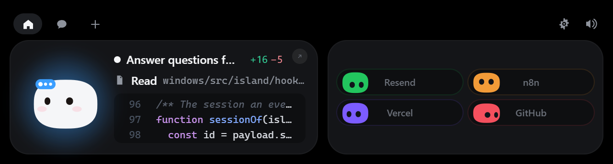

A session shows on its card, as the prototype draws it: the conversation's
title, the step under way — its icon, its name, the file or the command it is at
— and under it a look at what the step did: the lines of the file it read, the
diff of its edit, the command it ran with the end of what that printed. Once the
turn is over the card says **Done** and shows the first lines of what Claude
replied.

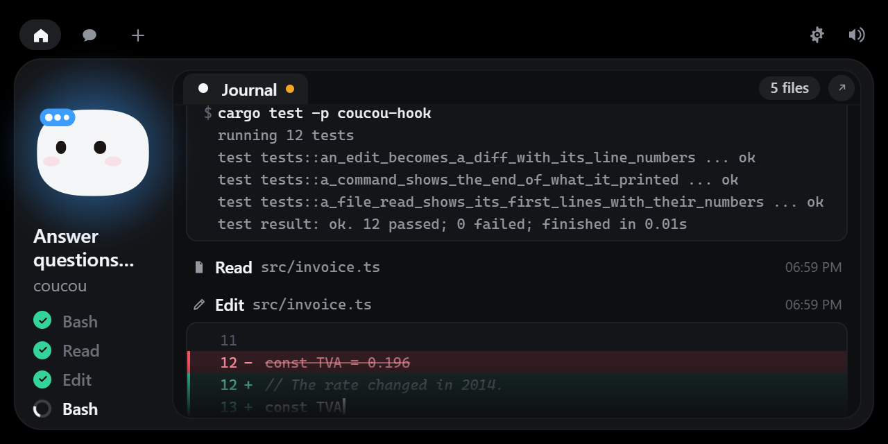

Click the card for the **session panel**. On the left, Mochi's column: the
session's name and its last steps, each going, done or failed. On the right, the
session's **journal**, read like a conversation, in the order things happened:

| A line of the journal | What it shows |
|---|---|
| What you asked | Your words, as you sent them |
| A file read | Its first lines, numbered |
| An edit | Its diff, the old line struck and the new ones typed under it |
| A command | The command, then the end of what it printed |
| A search | What it found |
| A question from Claude | Its options, and the ones that were picked — on the island or in Claude Code |
| A tool that had to ask first | **needs permission**, then **allowed** or **denied** |
| The end of the turn | What Claude said, as it wrote it — also behind **Read reply** on the finished card |

The journal follows the session while you are at its end, and stays where you
scrolled otherwise. **N files**, at the top right, lists every file the session
changed, each with its whole diff.

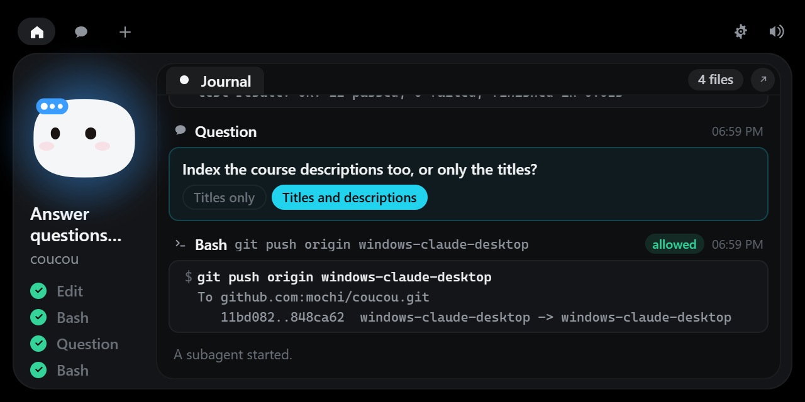

An edit is shown the moment Claude Code reports it, so the typing is a replay of
it, about a second behind. Nothing changes at a stroke: a new line rises into
place, a state's colour fades to the next. The island only watches: to write to
Claude, there is Claude Code.

### Several sessions at once

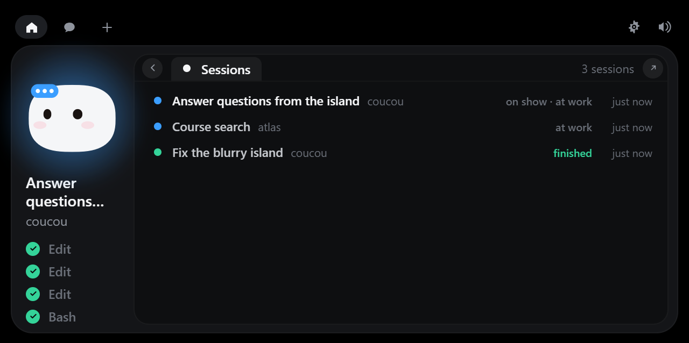

Two conversations in the Claude app, one more in a terminal: each is followed on
its own, and one of them is in front — the one the card, the panel and Mochi
show. With more than one, the session's card and the panel's head say how many
there are: that chip opens the list of them — each with its name, its project
and where it is at: at work, waiting for you, finished — and a click puts one in
front. The chip takes a colour when a session behind the one on show wants
looking at.

The island stays on the session it shows for as long as that one is at work or
being looked at. Another one takes its place when the first has nothing going
on, or to ask for something. When two ask at once, the second waits its turn:
the card says how many are waiting, and the next comes forward once the first is
answered. Up to four sessions are followed; past that, the one at rest and heard
from longest ago gives its place. Sessions started by a program rather than a
person — a review run by a plugin, a script using the SDK — are left alone.

### Answering from the island

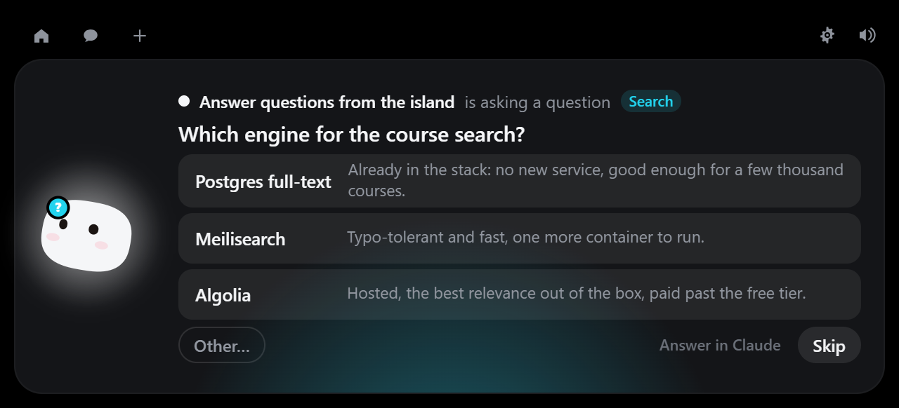
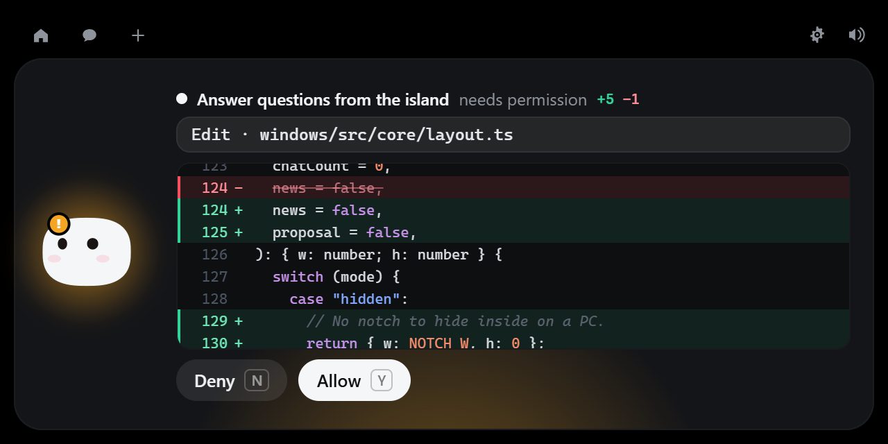

- **A question** Claude asks with its question tool opens on the island with
  its options, each with what it means. Pick one — or several, then **Send** —
  type your own with **Other…**, **Skip** it, or hand it back with **Answer in
  Claude**. The session goes on exactly as if you had answered in Claude Code.
- **A permission request for an edit** shows the diff the edit would make before
  you click **Allow**.

### What it reads

Everything comes from the hooks Claude Code already sends — nothing is asked of
Anthropic, and nothing leaves your machine. Of what a tool gives back, the relay
forwards a few lines and no more: the diff of an edit, the first lines of a file
that was read, the last lines a command printed, the names a search found, the
answers to a question. A session's journal is kept in memory and empties as it
fills — its last 80 lines, the oldest going for each new one — and is gone with
the session. Two
things are read from disk by the relay, and only then: the file an edit asks permission for (to show its diff —
it is never written), and the end of the session's transcript at the start and
end of a turn (for the conversation's title and Claude's last message). That
transcript's format is Claude Code's own: if it changes, the title and the last
message simply stop showing. None of it is written to the log.

## Chat and keys

**Settings… → Claude** takes your Anthropic API key. Keys live in the **Windows
Credential Manager**, never on disk and never in the interface — the island can
only ask whether a key exists. Same for every integration key.

No telemetry. The only network requests Coucou makes are to the services you
configure yourself.

## GitHub

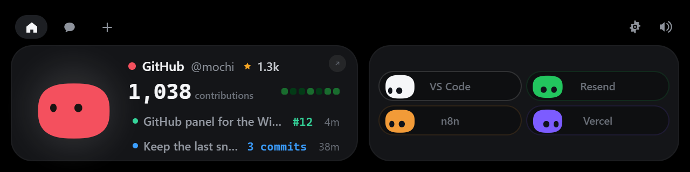

With GitHub as the focused pill, the overview shows your year at a glance and
your latest activity. Click the figure — or the arrow — and the island opens the
**GitHub panel**, where everything is read without leaving for the browser.

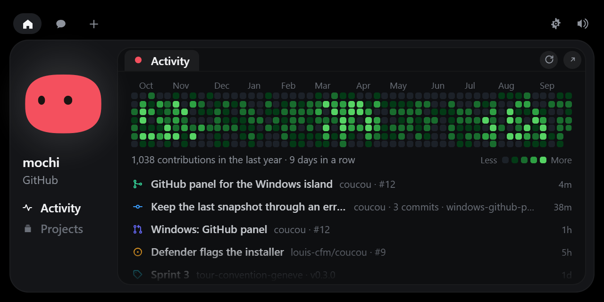

| Where | What you see |
|---|---|
| **Activity** | The contribution graph and your latest events. Click a day of the graph for what was done that day; click a line for its sheet |
| **Projects** | Your repositories, most recently pushed first, each with its latest build |
| A project | Description, languages, its last builds, its latest pull request, its latest deployment |
| A pull request | State, branches, labels, review, checks, the files with their diff |
| An issue, a push, a release | The same, each as its own sheet: the discussion, the commits and their files, the notes and assets |
| A run | Its jobs as mini Mochis, each with its steps and how long they took — followed live while it runs |
| Comments | A pull request's conversation: the description, the reviews, and each thread on the lines it is about |
| A file | Its diff, syntax-coloured. A thread opens the file on the line it was written on |

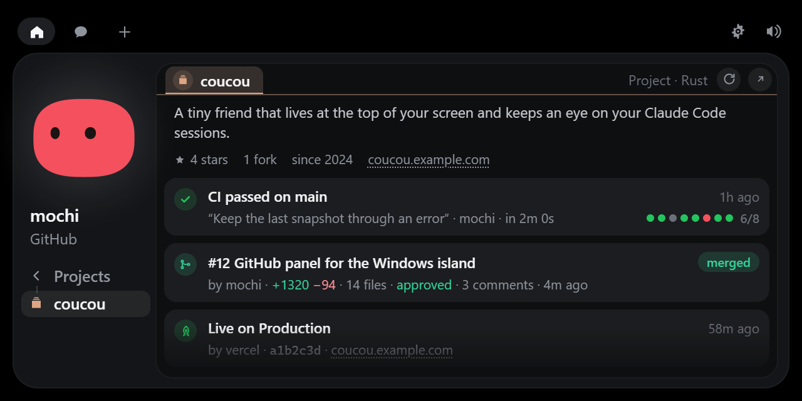
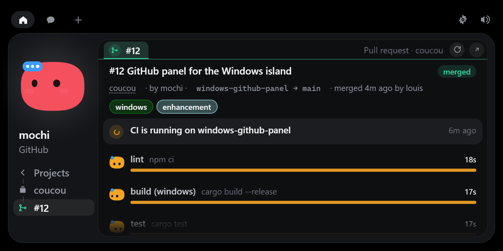
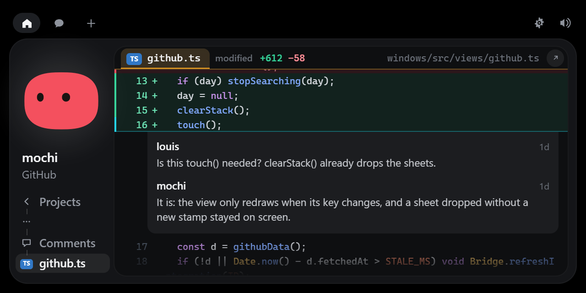

The trail on the left is the way back: every step you went through stays there,
one click away. The arrow at the top right opens the same thing on github.com.

### News

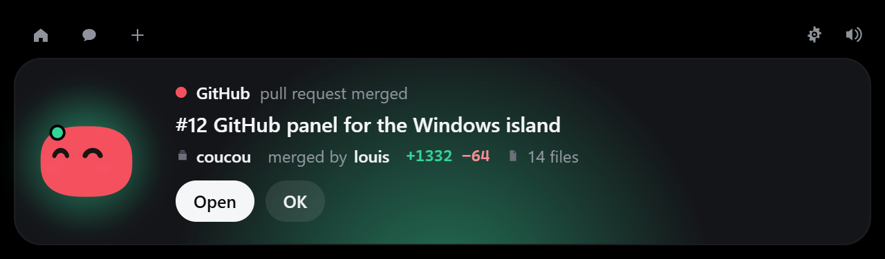

Three things make Mochi speak up, with a sound and a card: **a build of yours
breaks**, **a pull request of yours is merged**, and **somebody opens a pull
request on one of your projects** — the ones the Projects tab lists. **Open**
goes straight to the run or the pull request. Each project of that tab has a
bell: click it to mute a project you do not want to hear from, and again to give
it its voice back. **OK** folds the island and leaves the news on the pill
for five minutes, so it isn't lost: click Mochi, or the card, to go to it.

### The token

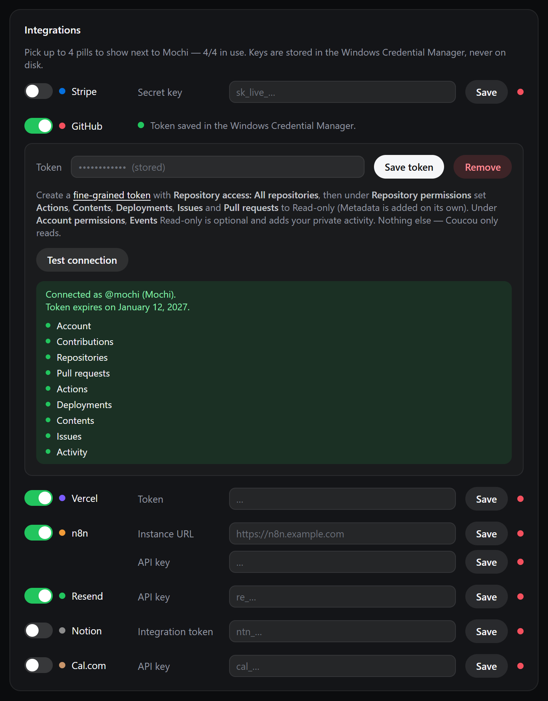

**Settings… → Integrations → GitHub**: switching it on opens its setup under its
line. Create a [fine-grained token](https://github.com/settings/personal-access-tokens/new)
with **Repository access: All repositories** and these permissions, all
**Read-only**:

| Permission | What it is for |
|---|---|
| Actions | Builds, runs, jobs and steps |
| Contents | Commits, diffs and releases |
| Deployments | A project's latest deployment |
| Issues | Issues and their comments |
| Pull requests | Pull requests, reviews and threads |
| Events (account, optional) | Your activity in private repositories |

Metadata is added by GitHub on its own. **Test connection** checks each of them
and names the one that is missing; in the panel, a part the token cannot read
says which permission it needs instead of showing up empty.

Coucou only reads, and nothing else is ever asked of GitHub. The token is stored
in the Windows Credential Manager like every other key: it never touches the
disk or the log, and the interface never sees it — every request is made by the
Rust side.

### How often it asks

- Every **2 minutes** for the activity, the projects and their builds. Answers
  GitHub says are unchanged (`304`) cost nothing against the rate limit.
- Every **20 seconds**, builds only, and only while one of your builds is running.
- A sheet is fetched **when you open it**, and kept for a minute.
- Nothing while Coucou is paused or GitHub is switched off.

## Build it yourself

You need [Rust](https://rustup.rs), [Node 20+](https://nodejs.org), and the
**MSVC build tools** (Visual Studio Build Tools with "Desktop development with
C++"). WebView2 ships with Windows 10/11.

```powershell
cd windows
npm install
npm run tauri dev      # live-reloading development build
npm run pack           # builds the installer and drops it in windows/release/
```

`npm run dev` alone serves the front end in an ordinary browser, which is enough
to work on the island's looks. It also serves two pages that never ship in the
app:

- `dev/upload-preview.html` replays the whole file-drop choreography on a loop —
  the one part of the UI that otherwise needs a real drag from Explorer to see.
- `dev/github-preview.html` shows the GitHub card and panel on made-up data, so
  they can be worked on without a token. The links at the bottom of the page go
  to each screen: a project, a run in progress, a failing build, the comments.
- `dev/claude-preview.html` plays a made-up Claude Code session through the
  island's own hook handler: a file being written, a question, a permission
  request with its diff, the end of a turn, several sessions at once.

`npm run pack` leaves two files in `windows/release/`, the same names the release
workflow publishes:

```
Coucou-Windows-X.Y.Z-setup.exe    the versioned installer
Coucou-Windows-setup.exe          the same file under the rolling name
```

Installing is optional — `target/release/coucou.exe` runs on its own. There is no
window in the taskbar and no console: the island at the top of the screen and the
Mochi in the notification area are the whole app, and Quit lives in its menu.

The 28 sounds are the macOS app's own files; they are never duplicated in this
folder. The path is declared once, in `SOUNDS_DIR` at the top of
`vite.config.ts` — when they move to `shared/sounds/`, change that one line.

The app icon and the tray icon are drawn in code, like Mochi itself:

```powershell
npm run icons          # regenerates src-tauri/icons from scripts/gen-icons.mjs
```

### Layout

```
windows/
  src/                 island front end (TypeScript, no framework)
    mochi/             Mochi and the launch greeting, in Canvas 2D
    island/            state machine, hooks, integrations
    views/             every island view
    settings/          the settings window
  src-tauri/           Rust backend: window, named pipe, Claude API, pollers
  hook/                coucou-hook.exe, the Claude Code relay
  scripts/             icon generator
```

### Log

`%LOCALAPPDATA%\Coucou\coucou.log` — hook events, permission decisions, poller
problems. It stays on your machine.

## What's different from the Mac version

- No notch, so the island lives at the top centre of the screen and retracts into
  the top edge instead of hiding in a notch.
- Permission approval works from **any** terminal; the Mac build only listens to
  VS Code sessions.
- The [session panel](#watching-a-session), answering Claude's questions and the
  diff on a permission request are Windows-only for now.
- Not in this version: sending a file by email, dragging Mochi onto a window to
  attach it as context, and jumping to a specific terminal window — "Open
  terminal" opens the working folder in VS Code when `code` is on your `PATH`.
- Cal.com shows the next bookings as a list rather than the Mac's calendar.
- GitHub goes further than the Mac's card: the [panel](#github), the news of a
  broken build or a merged pull request, and comments are Windows-only for now.

## Linux

The same app builds for Linux: everything that differs lives in
`src-tauri/src/platform/`, and the relay's transport in `hook/src/unix.rs`.

```bash
sudo apt install build-essential pkg-config \
  libwebkit2gtk-4.1-dev libgtk-layer-shell-dev libayatana-appindicator3-dev \
  librsvg2-dev libssl-dev libdbus-1-dev patchelf \
  gstreamer1.0-plugins-base gstreamer1.0-plugins-good
npm install
npm run tauri dev      # live-reloading development build
npm run pack           # AppImage, .deb and .rpm in windows/release/
```

What changes on Linux:

- **The island** is a gtk-layer-shell overlay anchored to the top edge, over any
  top panel, on compositors that support it: COSMIC, KDE Plasma, Hyprland, Sway
  and other wlroots compositors. GNOME has no layer-shell, so there the island
  is a regular window. `COUCOU_LAYER_SHELL=0` forces that mode anywhere.
- **Click-through** is the window's input region, kept equal to the island
  shape, so the compositor sends every other click to what is underneath.
- **Mochi's eyes** follow the pointer only while it is over the island: Wayland
  gives no app the cursor position anywhere else.
- **Claude Code hooks** go through `~/.local/share/coucou/bin/coucou-hook` and a
  Unix socket at `$XDG_RUNTIME_DIR/coucou.sock`. Both ends check that the other
  runs as the same user.
- **Keys** live in the Secret Service (GNOME Keyring, KWallet).
- **Files**: preferences in `~/.config/coucou/`, the log at
  `~/.local/share/coucou/coucou.log`.
- What the Windows build leaves out, this one does too: sending a file by
  email, dragging Mochi onto a window, and jumping to a specific terminal
  window — "Open terminal" opens the folder in VS Code.
